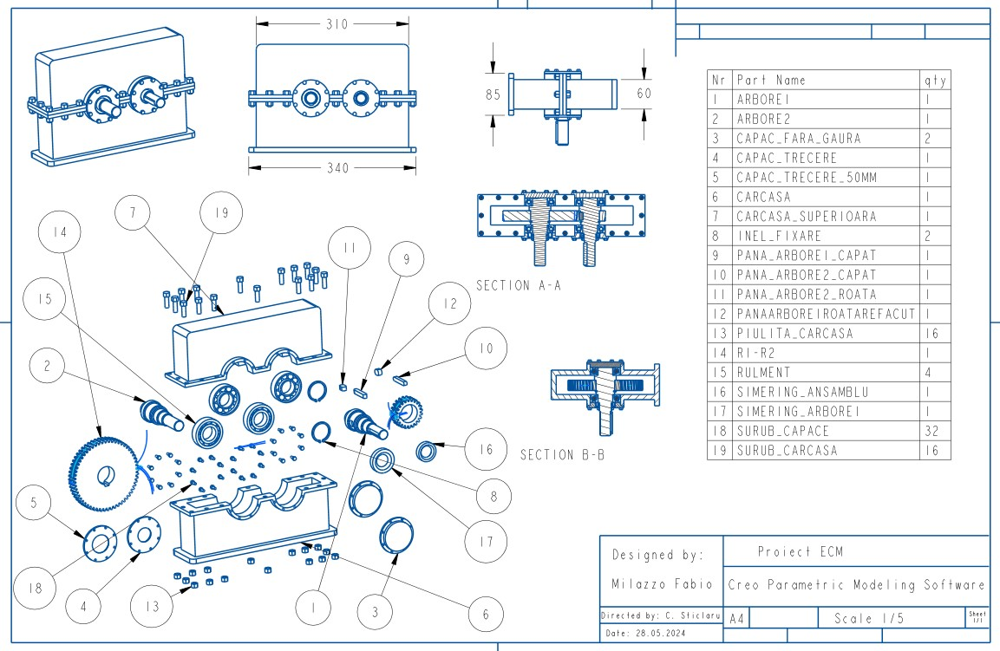

# Single-Stage (Fixed ratio) Gear Reducer

> Project Status: Provisional / Work In Progress
> This repository is currently being populated. Full calculation sheets and final manufacturing drawings will be added soon.

## Project Overview
This project involves the design and engineering analysis of a single-stage gear reducer. The mechanism is designed to transmit power from an input shaft to an output shaft with a fixed reduction ratio, utilizing a single pair of meshing gears (pinion and driven gear).

The design focuses on engineering a gear reducer based on a number of input values/factors, analyzing optimizing gear geometry for durability, efficiency, and compact size.

## Technical Specifications (Provisional)
The initial design parameters are based on the following input data:

| Parameter | Value | Description |
| :--- | :--- | :--- |
| Input Power (P1) | 3 kW | Power at the input shaft |
| Input Speed (n1) | 1500 rpm | Rotational speed of the input shaft |
| Transmission Ratio (i) | 2:1 | Reduction ratio |
| Output Speed (n2) | 750 rpm | Target rotational speed of the output shaft |
| Working Hours (Lh) | 5000 hours | Required design service life |
| Load Type | Constant | Operating condition |

## Mechanical Architecture
The gearbox utilizes a single-stage configuration:

1.  Input Shaft (Pinion): High-speed shaft connected to the motor, carrying the smaller driving gear.
2.  Output Shaft (Driven Gear): Low-speed shaft delivering the final torque, carrying the larger driven gear.
3.  Housing: Rigid casing designed to support bearings, maintain oil bath lubrication, and protect internal components.

## Design Drawings (Preliminary)

Below are the preliminary engineering drawings for the gear reducer assembly.

### Assembly View

*Cross-sectional view showing shaft arrangements, bearings, and gear meshing.*

### Input Shaft Drawing

*Isometric view of the gearbox housing and external components.*

## Planned Updates
The following documentation will be added to complete this repository:
- Full Excel calculation sheet (Gear geometric sizing, module selection, force analysis).
- Shaft fatigue analysis.
- Bearing selection and life calculation.
- Finalized 2D manufacturing drawings for individual components (shafts, gears, housing).

---
Project developed for the Mechanical Engineering curriculum.
